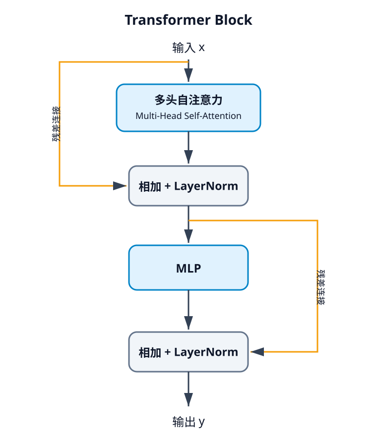

# lecture 8：注意力机制和Transformer

###### Attention让模型可以直接使用不同位置的信息

先看不使用Attention的RNN翻译：

Encoder读取源语言，得到隐藏状态 $h_1,h_2,\ldots,h_n$。传统方法只将最后一个隐藏状态交给Decoder，长序列的信息容易丢失。

加入Attention后，Decoder在每个时间步 $t$ 都会重新查看所有Encoder隐藏状态：

1. 使用上一步状态 $s_{t-1}$ 与每个 $h_i$ 计算匹配分数：
   $$
   e_{t,i}=f_{att}(s_{t-1},h_i)
   $$
2. 使用Softmax得到注意力权重：
   $$
   a_{t,i}=softmax(e_{t,i})
   $$
3. 对隐藏状态加权求和：
   $$
   c_t=\sum_i a_{t,i}h_i
   $$
4. Decoder使用 $c_t$ 更新状态并预测当前输出。

因此，Decoder的不同时间步可以关注不同的源语言Token。

## Attention is all you need：

上述的机制叫做注意力机制

**Query**：查询向量，对应上述的decoder的隐藏状态s

**Key**：与Query进行匹配，对应上述Encoder的隐藏状态h

**Value**：实际内容，匹配后使用的值，也对应上述的h

$Q=XW_Q,\ K=XW_K,\ V=XW_V$。三组权重将输入映射为查询、键和值。

设 $Q\in R^{N_Q\times D_Q}$，$K\in R^{N_K\times D_Q}$，$V\in R^{N_K\times D_V}$：
$$
E=\frac{QK^T}{\sqrt{D_Q}}\\
Attention(Q,K,V)=softmax(E)V
$$
当Q来自一组数据，K、V来自另一组数据时，称为交叉注意力；当三者都来自X时，称为自注意力。

自注意力：**[Q K V]=X[W_Q W_K W_V]**

如果交换X的顺序，输出也只会按相同方式交换。自注意力本身不知道顺序，因此需要加入位置编码。

掩码注意力：将不允许关注的位置设为负无穷，经过Softmax后其权重为0。

语言生成时会遮住未来的Token，使当前位置只能看到自己和之前的内容。

多头注意力：并行计算多个Attention，使不同的头学习不同关系，最后将结果拼接。

## Transformer:

Transformer模块由自注意力和MLP组成，并分别使用残差连接和层归一化：

